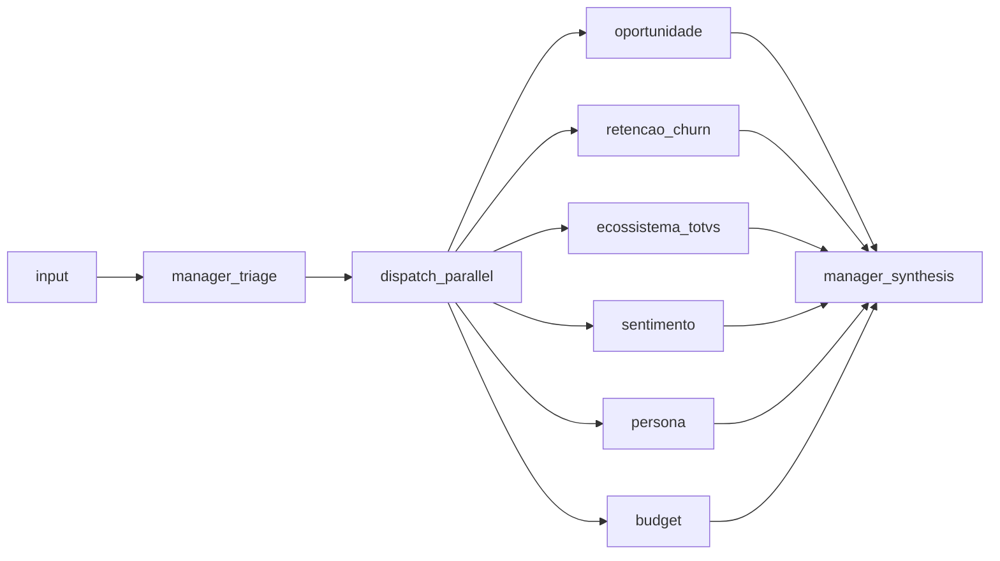

# Criar 6 agentes especializados (só config)

## Decisões fechadas

- **Onde:** somente [`backend/config/agents_config.py`](backend/config/agents_config.py)
- **Profundidade:** agentes executáveis via prompts ricos + contrato JSON de saída (o grafo/LLM já existentes rodão isso)
- **Substituição:** remover `geral` e `tecnico`; manter manager + LangGraph como estão
- **Arquitetura:** zero mudanças em `agents/`, `graph/`, routers ou `transcript_cleaner`

## Por que só esse arquivo basta

O projeto já está preparado para N especialistas:

- [`SPECIALIST_AGENTS`](backend/config/agents_config.py) é o registry
- [`build_graph()`](backend/graph/builder.py) cria nós `specialist_{key}` dinamicamente
- [`dispatch_to_specialists`](backend/agents/specialist.py) faz fan-out paralelo via `Send`
- Manager faz triage + síntese sem hardcode dos nomes antigos

## Alteração concreta

Em [`backend/config/agents_config.py`](backend/config/agents_config.py), substituir a lista `SPECIALIST_AGENTS` por estes 6 dicts (`key`, `name`, `system_prompt`):

| key | name | Foco do classificador |
|-----|------|------------------------|
| `oportunidade` | Oportunidade | Upsell, cross-sell, expansão, timing comercial |
| `retencao_churn` | Retenção/Churn | Sinais de churn, insatisfação, risco de cancelamento |
| `ecossistema_totvs` | Ecossistema TOTVS | Produtos/módulos TOTVS citados, gaps, integrações |
| `sentimento` | Sentimento | Polaridade e intensidade do cliente/participantes |
| `persona` | Persona | Papéis (decisor, influenciador, usuário), perfil |
| `budget` | Budget | Sinais de orçamento, restrição, capacidade de investimento |

Cada `system_prompt` deve:

1. Definir o papel do especialista no contexto de reuniões B2B TOTVS
2. Pedir análise **somente** sob aquela ótica (não misturar domínios)
3. Exigir resposta **apenas JSON** com schema estável

Schemas por agente:

- **oportunidade:** `label` ∈ `alta|media|baixa|nenhuma`; `opportunities[]` com `type`, `product_hint`, `next_step`
- **retencao_churn:** `label` ∈ `critico|alto|moderado|baixo`; `risk_drivers[]`; `retention_actions[]`
- **ecossistema_totvs:** `products_mentioned[]`; `gaps[]`; `integration_notes[]`; `label` ∈ `expansao|manutencao|migracao|indefinido`
- **sentimento:** `label` ∈ `positivo|neutro|negativo|misto`; `score` -1..1; `by_speaker[]` opcional
- **persona:** `personas[]` com `role`, `influence` (`alta|media|baixa`), `traits[]`
- **budget:** `label` ∈ `aprovado|em_discussao|restrito|ausente`; `signals[]`; `amount_hints[]`

Manter `SpecialistAgentConfig` e `get_agent_by_key` sem mudança de shape.

## O que NÃO muda

- [`backend/agents/manager.py`](backend/agents/manager.py) — triage continua escolhendo subset relevante (fallback: todos)
- [`backend/agents/specialist.py`](backend/agents/specialist.py), [`base.py`](backend/agents/base.py)
- [`backend/graph/*`](backend/graph/builder.py)
- API, frontend, `transcript_cleaner`
- Sem suíte de testes nova (fora do escopo “só o necessário”)

## Verificação manual após a mudança

Rodar uma análise via CLI/API com um transcript de reunião e confirmar:

1. Triage lista as 6 novas keys
2. Relatórios por especialista vêm com JSON no `content`
3. Síntese do manager consolida os 6 (ou o subset selecionado)
