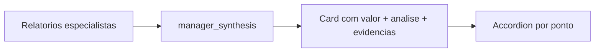

# Análise profunda por ponto no Card de Inteligência

## Decisão

- **UI:** accordion inline em cada item do card
- **Dados:** schema enriquecido na síntese do manager (uma chamada LLM, sem endpoint novo)

## Schema

Em [`backend/schemas/intelligence_card.py`](backend/schemas/intelligence_card.py), cada campo do card (exceto `conta` e `status`) vira um objeto:

```python
class CardPoint(TypedDict):
    valor: str          # linha curta (como hoje)
    analise: str        # 2–5 frases de aprofundamento
    evidencias: list[str]  # trechos/paráfrases de suporte
```

`IntelligenceCard` fica:

- `conta: str` (header, sem accordion)
- `ecossistema_mapeado`, `concorrente_citado`, `oportunidade`, `persona_detectada`, `sentimento`: `CardPoint`
- `status: str` (sem accordion — continua texto curto)

Atualizar `empty_intelligence_card()` e `parse_intelligence_card()`:

- Aceitar o formato novo (`{valor, analise, evidencias}`)
- Compatibilidade: se o LLM ainda devolver string plana no campo, promover para `{valor: str, analise: DEFAULT, evidencias: []}`
- Defaults seguros quando faltar análise/evidências

Exportar `CardPoint` em [`backend/schemas/__init__.py`](backend/schemas/__init__.py).

## Síntese do manager

Em [`backend/agents/manager.py`](backend/agents/manager.py), ajustar `MANAGER_SYNTHESIS_SYSTEM_PROMPT` para pedir JSON no formato enriquecido, pedindo que `analise` e `evidencias` consolidem os relatórios dos especialistas + entrada original (sem inventar). Manter `parse_intelligence_card` no retorno.

Sem mudanças no grafo, API ou specialists.

## Frontend

Em [`frontend/src/components/IntelligenceCard.jsx`](frontend/src/components/IntelligenceCard.jsx):

1. Normalizar cada ponto (`string` → `{ valor, analise, evidencias }`) para tolerar respostas antigas.
2. Cada item da lista vira botão/`<details>` estilo accordion: mostra label + `valor`; ao expandir, mostra `analise` e lista de `evidencias` (se houver).
3. Estado local `expandedKey` (um item aberto por vez) ou `<details>` nativo — preferir controle simples com `useState` para chevron e `aria-expanded`.
4. `conta` e `status` sem expansão.

Em [`frontend/src/App.css`](frontend/src/App.css): estilos para trigger do accordion, chevron, painel expandido (`analise` + bullets de evidências), mantendo o tema escuro atual do card.

[`UploadPage.jsx`](frontend/src/pages/UploadPage.jsx) não muda o contrato de props (`card={result.final_report}`).



## Fora de escopo

- Novo endpoint / chamada LLM sob demanda
- Alterar agentes especialistas ou o grafo
- Accordion em `conta` / `status`
