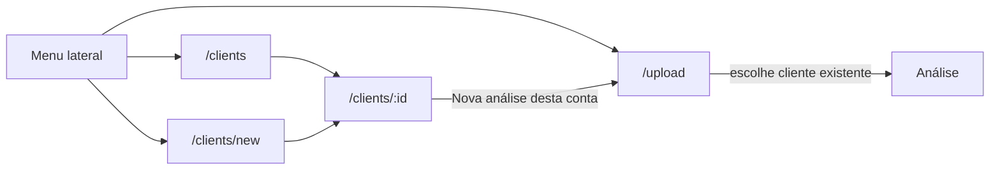

# Cadastro de clientes, análise separada e menu lateral

O frontend **não é mais Next.js**. A stack vigente é **Vite + React 19 + TypeScript + React Router + Tailwind 4 + shadcn/ui** (`new-york`, zinc), Manrope via `@fontsource`, lucide-react, axios. Páginas em [`frontend/src/pages/`](frontend/src/pages/), componentes em [`frontend/src/components/`](frontend/src/components/), alias `@/` → `src/`.

Hoje o cliente só tem `name`, é criado no meio do upload ([`frontend/src/pages/upload.tsx`](frontend/src/pages/upload.tsx)), e a navegação é um header com **Clientes | Nova análise** ([`frontend/src/components/header.tsx`](frontend/src/components/header.tsx)).

## Informações a coletar (pacote escolhido)

Campos pensados para inteligência de reuniões B2B: identificar a conta na lista e dar contexto para análises futuras.

- **Nome da conta** (já existe, único) — identidade
- **Segmento** — interpretação do discurso
- **Porte** (`PME` / `média` / `enterprise`) — ciclo e stakeholders
- **Website** — referência da empresa
- **Cidade / UF** — contexto regional
- **Contato principal** (nome, cargo, e-mail, telefone)
- **Dono interno** (CS/AE)
- **Status** (`prospect` / `ativo` / `inativo`)
- **Observações** — contexto livre

Nesta etapa os campos **só são persistidos e exibidos** — não entram no prompt dos agentes. Só `name` continua obrigatório.

## Fluxo alvo



- **Novo cliente**: página própria, fora do upload.
- **Nova análise**: só arquivo + select de cliente já cadastrado (sem “Criar” inline).
- Atalho na ficha: `/upload?client={id}` pré-seleciona a conta (`useSearchParams`).

## Backend

Modelo [`backend/models.py`](backend/models.py) — colunas novas em `Client` (opcionais, nullable):

- `segment`, `company_size`, `website`, `city`, `state`
- `contact_name`, `contact_role`, `contact_email`, `contact_phone`
- `owner`, `status` (default `"prospect"`), `notes`

`create_all` **não altera** SQLite existente. Em [`backend/db.py`](backend/db.py), após `create_all`, um `ALTER TABLE ... ADD COLUMN` idempotente para cada coluna nova.

Schemas e rotas em [`backend/schemas/clients.py`](backend/schemas/clients.py) e [`backend/routers/clients.py`](backend/routers/clients.py):

- `ClientCreate` / `ClientUpdate` (`name` obrigatório no create; update parcial via PATCH)
- `ClientListItem` e `ClientDetail` devolvem os campos novos
- `POST /api/clients` aceita o payload completo
- `PATCH /api/clients/{id}` para editar
- Unicidade de `name_key` no create e no update de nome

## Frontend — stack e convenções

Seguir o que já está no código:

- Rotas em [`frontend/src/App.tsx`](frontend/src/App.tsx) com `react-router-dom` (`Link`, `useNavigate`, `useParams`, `useSearchParams`, `Outlet`)
- UI shadcn já usada: `Button` (CTAs `rounded-full`, acento `orange-600`), `Card`, `Input`, `Label`, `Skeleton`
- Incluir via CLI shadcn (mesmo `components.json`): **Select**, **Textarea**, **Sheet** (drawer mobile)
- Sem `frontend/app/`, sem `next/link`, sem layout groups do App Router
- Login continua tela cheia sem chrome ([`frontend/src/pages/login.tsx`](frontend/src/pages/login.tsx))

## Frontend — menu lateral

Layout autenticado com nested routes, não um header por página:

```tsx
<Route element={<AppShell />}>
  <Route path="/clients" element={<ClientsPage />} />
  <Route path="/clients/new" element={<ClientNewPage />} />
  <Route path="/clients/:id" element={<ClientDetailPage />} />
  <Route path="/upload" element={<UploadPage />} />
</Route>
```

- Novo [`frontend/src/components/app-shell.tsx`](frontend/src/components/app-shell.tsx): sidebar fixa (desktop) + `Sheet` no mobile; `<Outlet />` no conteúdo
- Itens: **Clientes**, **Novo cliente**, **Nova análise**; marca Insight Hive no topo; **Sair** no rodapé
- Ativo: `text-orange-600` + fundo suave; `Link` do React Router
- Páginas autenticadas deixam de importar [`Header`](frontend/src/components/header.tsx); o header pode ser removido ou ficar só como fallback

## Frontend — cadastro e ficha

- [`frontend/src/components/client-form.tsx`](frontend/src/components/client-form.tsx): form compartilhado (create/edit) com Inputs, Selects de porte/status, Textarea de observações
- [`frontend/src/pages/client-new.tsx`](frontend/src/pages/client-new.tsx): `POST /clients` → `navigate('/clients/{id}')`
- Lista [`frontend/src/pages/clients.tsx`](frontend/src/pages/clients.tsx): CTA **Novo cliente**; cards com status/segmento
- Ficha [`frontend/src/pages/client-detail.tsx`](frontend/src/pages/client-detail.tsx): bloco da conta + editar (`PATCH`) + timeline; **Nova análise** → `/upload?client={id}`
- Tipos em [`frontend/src/lib/types.ts`](frontend/src/lib/types.ts)

## Frontend — nova análise

Em [`frontend/src/pages/upload.tsx`](frontend/src/pages/upload.tsx):

- Remover criação inline de cliente
- Select shadcn de clientes existentes + arquivo
- Lista vazia: CTA para `/clients/new`
- `useSearchParams()` lê `client` e pré-seleciona
- Link “Ver no histórico” após sucesso permanece (`<Link to={...}>`)

## Fora de escopo

- Injetar ficha do cliente no grafo/LLM
- Excluir cliente
- Alembic / Postgres
- Filtros avançados na lista
- Voltar para Next.js
