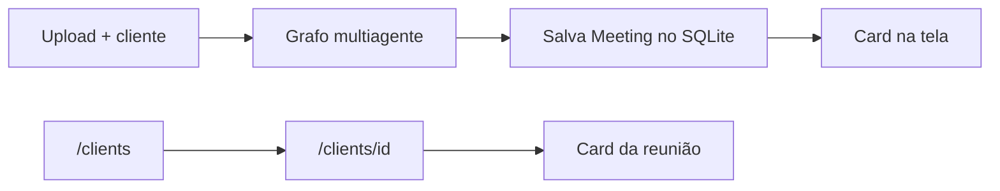

# Histórico de análises por cliente

Hoje o upload em [`backend/routers/analysis.py`](backend/routers/analysis.py) devolve o card e descarta o resultado. O usuário escolhe o cliente **antes** de analisar; a UI mostra uma timeline por cliente (sem diff entre reuniões).

## Modelo de dados

SQLite local (`backend/data/insight_hive.db`, gitignored) com SQLAlchemy 2.0 síncrono — o grafo já é síncrono. `create_all` no startup da API; sem Alembic nesta etapa.

- **Client:** `id`, `name` (único, case-insensitive), `created_at`
- **Meeting:** `id`, `client_id` (FK), `source_filename`, `created_at`, `triage` (text), `selected_agents` (JSON), `final_report` (JSON do IntelligenceCard)

Não guardar o arquivo/transcrição bruta: só o resultado da análise (triagem, agentes, card). `DATABASE_URL` em [`.env.example`](backend/.env.example), default `sqlite:///./data/insight_hive.db`.

## Backend

Novos módulos: [`backend/db.py`](backend/db.py) (engine, session, `get_db`), [`backend/models.py`](backend/models.py), [`backend/routers/clients.py`](backend/routers/clients.py). Registrar o router em [`backend/api.py`](backend/api.py).

Endpoints JWT:

- `GET /api/clients` — lista com `meetings_count` e `last_meeting_at`
- `POST /api/clients` — `{ name }` (409 se nome duplicado)
- `GET /api/clients/{id}` — cliente + reuniões resumidas (id, filename, created_at, `conta`/`status` do card), **mais recente primeiro**
- `GET /api/meetings/{id}` — análise completa (mesmo shape do upload + `client`, `source_filename`, `created_at`)
- `DELETE /api/meetings/{id}` — remover reunião pontual (erro de upload)

Upload em [`backend/routers/analysis.py`](backend/routers/analysis.py): `client_id: int = Form(...)` obrigatório. Depois do grafo, persiste `Meeting` e devolve `{ id, client_id, ..., triage, selected_agents, final_report }`. 404 se o cliente não existir.

## Frontend

Manter App Router + shadcn. Nav no [`frontend/components/header.tsx`](frontend/components/header.tsx): **Clientes** | **Nova análise**.

- [`frontend/app/upload/page.tsx`](frontend/app/upload/page.tsx): select de cliente (lista da API) + campo para criar um novo (POST `/clients` e selecionar). **Analisar** só habilita com cliente + arquivo. Após sucesso, link “Ver no histórico do cliente”.
- `frontend/app/clients/page.tsx`: cards de clientes (nome, nº de reuniões, última data).
- `frontend/app/clients/[id]/page.tsx`: timeline vertical; clique abre o card (IntelligenceCard + triagem + agentes), reusando [`frontend/components/intelligence-card.tsx`](frontend/components/intelligence-card.tsx). Sem comparação entre reuniões.
- [`frontend/app/page.tsx`](frontend/app/page.tsx): autenticado redireciona para `/clients` (hub do histórico).
- Helpers em [`frontend/lib/api.ts`](frontend/lib/api.ts).

## Fora de escopo

Diff entre reuniões, edição do card, multi-usuário/tenant, Postgres, guardar o CSV/JSON original.
