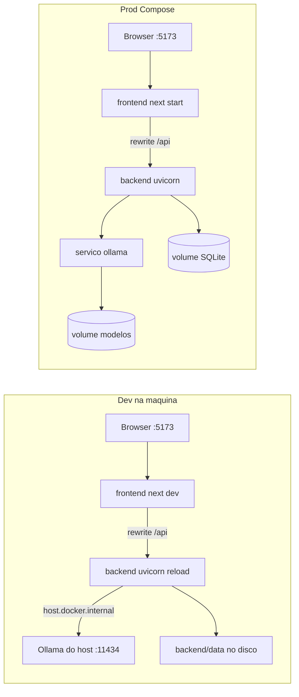

# Docker: ambientes de desenvolvimento e produção

O stack atual é FastAPI (`:8000`) + Next.js (`:5173`) + SQLite em arquivo + Ollama na máquina (`:11434`). Não há Docker hoje. O Next faz proxy de `/api` para `localhost:8000`, o CORS está fixo em localhost, e o `ChatOllama` não aceita URL configurável — isso precisa mudar para os containers se falarem entre si.

Cada serviço é um **container separado**: frontend, backend e (em produção) Ollama. No dev o Ollama continua no host.

## Como você vai usar

Na raiz do repo, depois de ter o [Docker Desktop](https://www.docker.com/products/docker-desktop/) instalado:

- **Dev** (dia a dia, hot-reload, Ollama da máquina):
  `docker compose -f docker-compose.yml -f docker-compose.dev.yml up --build`
- **Prod** (na sua máquina para testar, ou depois no servidor):
  `docker compose -f docker-compose.yml -f docker-compose.prod.yml up -d --build`
  e na primeira vez: `docker compose ... exec ollama ollama pull gpt-oss:20b`

O `docker-compose.yml` fica só com o que é comum (rede, serviços backend/frontend, variáveis). Os overlays separam bind-mounts vs imagens fechadas, e Ollama no host vs no Compose.

## Arquivos novos

- [`.dockerignore`](.dockerignore) — ignora `.git`, `node_modules`, `.next`, `.venv`, `backend/data`, `.env`
- [`backend/Dockerfile`](backend/Dockerfile) — contexto na **raiz** do repo (precisa de `transcript_cleaner/` + `backend/`). Targets `dev` e `prod` em `python:3.11-slim`. `WORKDIR /app/backend` para o `-e ../transcript_cleaner` do [`backend/requirements.txt`](backend/requirements.txt) continuar válido. Prod: `uvicorn api:app --host 0.0.0.0 --port 8000`
- [`frontend/Dockerfile`](frontend/Dockerfile) — `node:22-alpine`, targets `dev` (`npm run dev`) e `prod` (build + `output: 'standalone'`). Não copiar `public/` (a pasta não existe). `HOSTNAME=0.0.0.0` e `PORT=5173`
- [`docker-compose.yml`](docker-compose.yml) — serviços `backend` e `frontend`, `env_file: backend/.env`
- [`docker-compose.dev.yml`](docker-compose.dev.yml) — bind mounts (`./backend`, `./transcript_cleaner`, `./frontend`), volume anônimo para `node_modules`, `--reload`, porta `8000` publicada (Swagger), `OLLAMA_BASE_URL=http://host.docker.internal:11434`, `extra_hosts: host.docker.internal:host-gateway`, `WATCHPACK_POLLING=true` (file watch no Windows)
- [`docker-compose.prod.yml`](docker-compose.prod.yml) — targets `prod`, volume nomeado `backend_data` em `/app/backend/data`, serviço `ollama` (`ollama/ollama`) com volume `ollama_data`, `OLLAMA_BASE_URL=http://ollama:11434`, `restart: unless-stopped`, backend **sem** publicar `8000` (só a rede interna; o browser fala com `:5173`). GPU NVIDIA como bloco comentado para ligar no servidor se houver placa

## Ajustes de código (necessários para os containers)

1. **[`frontend/next.config.ts`](frontend/next.config.ts)** — `output: 'standalone'` e rewrite com `BACKEND_INTERNAL_URL` (default `http://localhost:8000`).
2. **[`frontend/package.json`](frontend/package.json)** — `next dev -H 0.0.0.0 -p 5173`.
3. **[`backend/agents/base.py`](backend/agents/base.py)** — `base_url` no `ChatOllama` via `OLLAMA_BASE_URL`.
4. **[`backend/api.py`](backend/api.py)** — `CORS_ORIGINS` via env.
5. **[`backend/.env.example`](backend/.env.example)** — documentar `OLLAMA_BASE_URL` e `CORS_ORIGINS`.
6. **[`README.md`](README.md)** — seção Docker.

## Persistência e Ollama

- **Dev:** o bind mount de `./backend` já persiste `backend/data/insight_hive.db` no disco.
- **Prod:** volume Docker `backend_data`.
- **Dev Ollama:** processo instalado no Windows; o container chama `host.docker.internal:11434`.
- **Prod Ollama:** o modelo não vem na imagem. Primeiro `up` + `ollama pull gpt-oss:20b`.
