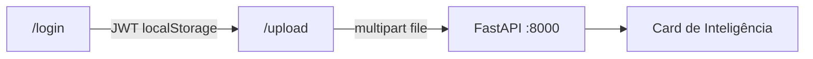

# Frontend Next.js inspirado no SaaS Starter

Migrar só a pasta [`frontend/`](frontend/) para **Next.js (App Router) + Tailwind CSS + shadcn/ui**, copiando o *look* do [nextjs/saas-starter](https://github.com/nextjs/saas-starter): fundo claro zinc/gray, acento laranja, fonte Manrope, CTAs em pílula, chrome mínimo. **Não** trazer Stripe, Postgres, Drizzle, cookies JWT nem landing/pricing.

O contrato com a API permanece o mesmo: `POST /api/auth/login` (form) e `POST /api/analysis/upload` (multipart + Bearer).



## Por que Next.js na pasta `frontend/`

O backend só libera CORS em `localhost:5173`. Para não tocar em [`backend/api.py`](backend/api.py):

- Rodar `next dev -p 5173` (mesma URL de hoje).
- Proxy em [`frontend/next.config.ts`](frontend/next.config.ts): `/api/:path*` → `http://localhost:8000/api/:path*`.
- Axios com `baseURL: '/api'` (same-origin). CORS deixa de ser necessário no dev.

## Stack (espelho do starter, sem o backend dele)

- Next.js 15 App Router + React 19 + TypeScript
- Tailwind CSS 4 + shadcn/ui (`new-york`, base **zinc**)
- `next/font/google` **Manrope**
- lucide-react (ícones)
- axios (login/upload iguais aos atuais)
- npm (já existe `package-lock.json`)

Remover Vite: `vite.config.js`, `index.html`, `src/main.jsx`, `App.jsx`, CSS global atual, `react-router-dom`.

## Rotas (mesmo produto)

| Rota | Papel |
|------|--------|
| `/` | redirect para `/login` (ou `/upload` se já autenticado) |
| `/login` | formulário público |
| `/upload` | app autenticado |

Auth continua **client-side** (`localStorage.token`), porque o backend devolve JWT no body e o middleware do Next não lê `localStorage`. Sem cookies, sem `middleware.ts` de auth.

## Visual a copiar do starter

**Login** — tela cheia `bg-gray-50`, formulário central `max-w-md`, marca (ícone laranja + “Insight Hive”), título extrabold, inputs e botão **rounded-full**, CTA `orange-600`, erro em texto vermelho. Copy em português.

**Upload** — header fino (`border-b`): logo à esquerda, “Sair” em pílula outline à direita. Conteúdo em `max-w-3xl`: Card shadcn para o formulário de arquivo; durante a análise, skeleton + aviso de espera (o modelo local demora); resultado em Cards (triagem, agentes) + card de inteligência.

**Card de Inteligência** — manter a lógica de [`IntelligenceCard.jsx`](frontend/src/components/IntelligenceCard.jsx) (normalização, accordion, evidências). Visual: widget escuro tipo o Terminal do starter (`bg-gray-900`, cantos `rounded-xl`), não o navy/roxo atual.

## Estrutura alvo

```
frontend/
  app/
    layout.tsx          # Manrope + Providers
    globals.css         # tokens shadcn + acento laranja
    page.tsx            # redirect
    login/page.tsx
    upload/page.tsx
  components/
    providers.tsx
    header.tsx
    intelligence-card.tsx
    ui/                 # button, input, label, card, skeleton
  lib/
    api.ts
    auth-context.tsx
    utils.ts            # cn()
  next.config.ts
  components.json
```

Arquivos a portar 1:1 em comportamento:

- [`frontend/src/context/AuthContext.jsx`](frontend/src/context/AuthContext.jsx) → `lib/auth-context.tsx`
- [`frontend/src/api/client.js`](frontend/src/api/client.js) → `lib/api.ts` (`baseURL: '/api'`)
- [`frontend/src/components/IntelligenceCard.jsx`](frontend/src/components/IntelligenceCard.jsx) → `components/intelligence-card.tsx`

## Fora de escopo

- Backend, `.env`, CORS, LangGraph, transcript cleaner
- Landing, pricing, sidebar, Stripe, seed users
- Trocar JWT/localStorage por cookies

## Docs

Atualizar só a seção **Frontend** do [`README.md`](README.md) (Next.js, `cd frontend && npm install && npm run dev`, continua em `http://localhost:5173`) e o [`frontend/README.md`](frontend/README.md) do template Vite.
