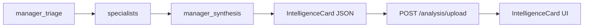

# Card de Inteligência na saída final

## Contexto

Hoje [`manager_synthesis`](backend/agents/manager.py) pede um relatório narrativo e grava `final_report: str`. A API em [`analysis.py`](backend/routers/analysis.py) devolve essa string e o frontend mostra em `<pre>` em [`UploadPage.jsx`](frontend/src/pages/UploadPage.jsx).

O grafo (`triage → specialists → synthesis`) permanece igual. Só mudam o **contrato da síntese**, o **schema** e a **UI**.



## Schema do card (backend)

Criar [`backend/schemas/intelligence_card.py`](backend/schemas/intelligence_card.py) com `TypedDict` (padrão já usado em [`state.py`](backend/graph/state.py)):

```python
class IntelligenceCard(TypedDict):
    conta: str
    ecossistema_mapeado: str
    concorrente_citado: str
    oportunidade: str
    persona_detectada: str
    sentimento: str
    status: str
```

Campos alinhados ao exemplo visual (Conta, Ecossistema mapeado, Concorrente citado, Oportunidade, Persona detectada, Sentimento, Status).

Incluir helper `empty_intelligence_card()` / `parse_intelligence_card(raw)` com defaults seguros (`"Não identificado"` / `"Pendente revisão humana"`) para quando o LLM falhar no JSON.

## `manager_synthesis`

Em [`backend/agents/manager.py`](backend/agents/manager.py):

1. Trocar `MANAGER_SYNTHESIS_SYSTEM_PROMPT` para pedir **apenas JSON** no formato do schema (sem markdown), consolidando os relatórios dos especialistas + entrada original.
2. Parsear a resposta com o helper do schema (mesmo padrão de fallback de `manager_triage`).
3. Retornar `{"final_report": card_dict}` — a chave do estado permanece `final_report`; o valor passa a ser o objeto do card.

Em [`backend/graph/state.py`](backend/graph/state.py): tipar `final_report` como `IntelligenceCard` (ou `dict`) em vez de `str`.

Em [`backend/routers/analysis.py`](backend/routers/analysis.py): continuar devolvendo `final_report` (agora objeto JSON). Sem novos endpoints.

Em [`backend/main.py`](backend/main.py): se imprime `final_report`, usar `json.dumps(..., ensure_ascii=False, indent=2)`.

## Frontend

1. Novo componente [`frontend/src/components/IntelligenceCard.jsx`](frontend/src/components/IntelligenceCard.jsx): lista vertical com título **Card de Inteligência**, subtítulo `conta`, e itens (dot colorido + label + valor) para os 6 atributos restantes.
2. Estilos dedicados em [`App.css`](frontend/src/App.css) (`.intelligence-card`, dots semânticos) no tema escuro do exemplo (`#1a2639`), sem reescrever o layout geral do app.
3. Em [`UploadPage.jsx`](frontend/src/pages/UploadPage.jsx): substituir `<pre>{result.final_report}</pre>` por `<IntelligenceCard card={result.final_report} />`, mantendo triagem e agentes selecionados.

## Fora de escopo

- Não alterar `SPECIALIST_AGENTS`, `builder.py`, nem o fan-out de especialistas.
- Não integrar `transcript_cleaner`.
- Não criar novos agentes (ex.: concorrente); o manager extrai `concorrente_citado` a partir da entrada + relatórios existentes.
