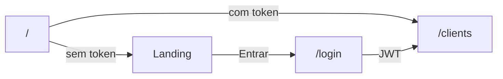

# Landing page no lugar do login inicial

Hoje [`frontend/src/pages/home.tsx`](frontend/src/pages/home.tsx) só redireciona visitantes para `/login`. A rota `/` passa a renderizar uma landing pública; quem já estiver autenticado continua indo para `/clients`. O login permanece em `/login`.

Referência de **estrutura** (não de código): [Open React Template](https://github.com/cruip/open-react-template) / [demo](https://open.cruip.com/). Paleta **atual** do app: `bg-gray-50`, `text-gray-900`, acento `orange-500/600`, Manrope, botões `rounded-full`. Sem migrar para Next.js.

**Licença:** o template é GPL. Recriar layout e padrões visuais; **não** copiar componentes, SVGs nem CSS do repositório Cruip.

## Rotas e auth

- [`frontend/src/pages/home.tsx`](frontend/src/pages/home.tsx): se `ready && token` → `<Navigate to="/clients" />`; senão, montar a landing.
- [`frontend/src/App.tsx`](frontend/src/App.tsx): sem mudança de rotas (`/` e `/login` já existem).
- [`frontend/src/pages/login.tsx`](frontend/src/pages/login.tsx): link discreto “Voltar ao início” → `/`.
- App autenticado (`AppShell`) permanece igual.

## Seções (ordem do Open, conteúdo do produto)

Composição em `home.tsx`. Componentes novos em `frontend/src/components/landing/`.

1. **Header flutuante** (`landing-header.tsx`) — barra pill `rounded-2xl` + `backdrop-blur` + borda suave, logo (`CircleIcon` laranja + “Insight Hive”) à esquerda; à direita um único CTA **Entrar** (`/login`), `rounded-full bg-orange-600`. Sem Register (não há cadastro público).
2. **Hero** (`landing-hero.tsx`) — eyebrow (“Análise multiagente”), headline grande, subcopy, dois CTAs: primário Entrar + secundário âncora “Como funciona”. Em vez do vídeo do template, um mock estático do card de inteligência (bloco escuro `bg-gray-900 rounded-xl`, no espírito do [`intelligence-card.tsx`](frontend/src/components/intelligence-card.tsx)).
3. **Fluxo** (`landing-workflows.tsx`) — 3 cards (equivalente aos Workflows do Open):
   - Cadastre a conta
   - Envie a transcrição (CSV/JSON)
   - Receba o relatório dos especialistas
4. **Capacidades** (`landing-features.tsx`) — grid de 6 itens alinhado aos agentes reais: Oportunidade, Retenção/Churn, Ecossistema TOTVS, histórico por cliente, limpeza de transcrição, login JWT. Sem depoimentos fictícios.
5. **CTA final** (`landing-cta.tsx`) — faixa “Entre e analise a próxima reunião” + botão Entrar.
6. **Footer** (`landing-footer.tsx`) — marca + linha curta (produto interno / multiagente TOTVS).

Atmosfera: blobs CSS laranja/cinza bem suaves atrás do hero (`blur-3xl`, `opacity` baixa) — equivalente ao *page illustration* do Open, sem SVGs do template.

Copy em português, tom B2B (reuniões, upsell, churn, catálogo TOTVS).

## Visual: Open + cores atuais

- Open `gray-950` + indigo → Insight Hive `gray-50` + `orange-600`
- Headline com gradient indigo → Headline `text-gray-900` + trecho em `text-orange-600`
- Cards dark + spotlight mouse → Cards brancos `rounded-2xl`, borda `gray-200`, hover com glow laranja leve
- Header glass dark → Header glass claro (`bg-white/80`)
- Dual CTA indigo/gray → Dual CTA `orange-600` / outline `rounded-full`

Sem AOS, masonry nem `useMousePosition` do template. Animações mínimas com o `tw-animate-css` já no projeto, se fizer sentido.

## Fora de escopo

- Não copiar código/assets do Cruip.
- Não criar `/signup`.
- Não alterar backend, Docker, `AppShell` nem páginas autenticadas.
- Não migrar para Next.js.
