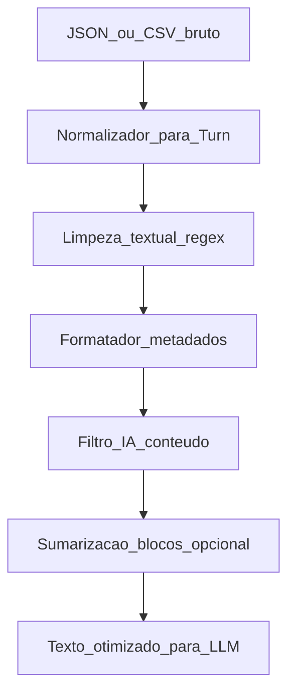

# Pipeline de Limpeza de Transcrições para LLMs

> **Handoff para agentes:** [`transcript_cleaner/README.md`](../../transcript_cleaner/README.md)  
> **Código:** pacote isolado em `transcript_cleaner/` (raiz do repo).  
> **Não integrar** em `backend/agents` ou `backend/graph` sem cola explícita no entrypoint.

## Objetivo

Reduzir tokens e ruído semântico em transcrições de reunião (entrada **JSON** ou **CSV**), preservando decisões, ações, prazos e discussões relevantes para análise por LLM.

Escopo deste plano: **arquitetura e fluxo**. O produto natural é um texto (ou JSON estruturado) otimizado, pronto para qualquer LLM consumidor.

## Isolamento do módulo (requisito arquitetural)

O pipeline vive como **módulo independente** do restante do backend. Bidirecional:

1. **O cleaner não depende** de `agents/`, `graph/`, `routers/`, `file_input`, `security`, `api`, nem de configs/modelos do multiagente.
2. **O backend existente não precisa** importar nem conhecer o cleaner para continuar funcionando. Nenhuma mudança obrigatória em módulos atuais.

```mermaid
flowchart LR
  subgraph backendExistente [Backend_existente]
    api[api_routers]
    graph[graph_agents]
  end
  subgraph cleanerPkg [transcript_cleaner]
    parse[normalize]
    s1[stage1_regex]
    s2[stage2_format]
    s3[stage3_filter]
    s4[stage4_compress]
  end
  caller["Caller_opcional_CLI_ou_script"]
  caller -->|"usa API publica"| cleanerPkg
  backendExistente -.->|"sem imports"| cleanerPkg
  cleanerPkg -.->|"sem imports"| backendExistente
```

**Forma concreta:**

| Regra | Detalhe |
|---|---|
| Pacote próprio | Ex.: `backend/transcript_cleaner/` **ou** pasta irmã `transcript_cleaner/` na raiz — preferência: **pacote irmão na raiz** para deixar a separação óbvia |
| API pública mínima | `clean_file(path \| bytes, format)` / `clean_turns(turns) → CleanResult` |
| Dependências | Só stdlib + libs próprias do pacote (ex.: nada de LangGraph/LangChain/FastAPI). Etapas 1–2 100% determinísticas |
| LLM (etapas 3–4) | Porta abstrata `LlmClient.complete(prompt) → str` **injetada pelo caller**. Sem cliente Ollama/LangChain dentro do pacote. Se nenhum client for passado, rodar só etapas 1–2 (e heurísticas de DROP) |
| Config | Fillers, limiares e aliases **dentro do pacote** (YAML/JSON próprios), não em `agents_config.py` |
| Testes | Suite própria do pacote, sem subir API nem grafo |
| Composição futura | Se um dia o insight-hive usar o cleaner, a cola fica **só** no ponto de entrada (ex. um script ou uma linha no router) — nunca no núcleo de agents/graph |

Isso garante: desenvolver, testar e versionar a limpeza sem arrastar nem ser arrastado pelo multiagente.

## Schema interno canônico

Antes de limpar, normalizar JSON e CSV para uma lista de turnos:

```text
Turn {
  speaker: str          # nome original do palestrante
  text: str             # fala
  start: str | null     # HH:MM:SS (opcional)
  end: str | null
}
```

**Contrato de colunas/campos esperado** (mapeável com aliases):

| Campo canônico | Aliases comuns |
|---|---|
| `speaker` | `speaker`, `falante`, `nome`, `participant` |
| `text` | `text`, `texto`, `content`, `fala`, `transcript` |
| `start` | `start`, `inicio`, `timestamp`, `start_time` |
| `end` | `end`, `fim`, `end_time` |

- **CSV**: cabeçalho com esses nomes (ou aliases); uma linha = um turno.
- **JSON**: array de objetos com os mesmos campos, ou `{ "segments": [...] }`.
- Validação: rejeitar arquivo sem `text`; `speaker` ausente vira `UNKNOWN`.

Saída intermediária após limpeza: mesma lista de `Turn` (já filtrada/mesclada) **ou** texto linear compacto:

```text
[P1] 00:12:04 Texto da fala mesclada...
[P2] 00:12:18 Resposta...
```

## Fluxo recomendado



Regras de custo: etapas 1–2 são **determinísticas e baratas**; etapa 3 usa LLM leve; etapa 4 só se a duração/token count passar de um limiar.

---

## Etapa 1 — Limpeza textual superficial (regex + dicionários)

Objetivo: remover ruído de ASR/fala humana sem mudar significado.

**Operações por `text` de cada turno:**

1. **Preenchimentos (PT-BR)**: dicionário configurável — `hum`, `hã`, `éé`, `tipo`, `né`, `tá ligado`, `assim`, `então` (como filler isolado), `ahh`, `uhm`, etc. Remover só como tokens isolados/pontuação adjacente, não substrings dentro de palavras.
2. **Gagueiras / repetições imediatas**: colapsar `nós nós vamos` → `nós vamos`; também bigramas repetidos (`a gente a gente`).
3. **Espaços e quebras**: colapsar whitespace múltiplo; remover linhas vazias; trim.
4. **Artefatos de ASR** (se existirem no corpus): `[inaudível]`, `(risos)`, tags de confiança — política: remover por padrão; opcionalmente manter `[inaudível]` se a análise precisar sinalizar lacunas.

**Guardrails:** não alterar números, nomes próprios, URLs, códigos. Dicionário de fillers versionado e expandível (lista YAML/JSON).

**Métrica:** % de redução de caracteres por turno; amostra de before/after para regressão manual.

---

## Etapa 2 — Otimização de metadados e formato

Objetivo: tags curtas e menos repetição estrutural (LLMs “pagam” por cada token de rótulo).

1. **Mapa de palestrantes**: `João Silva` → `P1` (ou iniciais estáveis `JOAO`). Manter tabela `P1=João Silva` no cabeçalho do documento limpo (1 vez).
2. **Timestamps**: se presentes, arredondar para `HH:MM:SS` (sem ms). Política padrão: manter timestamp só no **início de cada bloco mesclado** (não em cada frase).
3. **Mesclar falas consecutivas** do mesmo `speaker` num único turno (juntar `text` com espaço). Isso corta tags `[P1]` repetidas.
4. **Serialização final** preferida para LLM:

```text
# Speakers
P1=João Silva
P2=Maria Souza

[P1] 00:01:12 ...
[P2] 00:01:40 ...
```

Evitar prosa do tipo “O participante João Silva disse que…”.

---

## Etapa 3 — Filtragem de conteúdo não essencial (IA leve)

Objetivo: cortar small talk e feedbacks vazios que sobrevivem ao regex.

**Entrada:** blocos/turnos já formatados (não o arquivo bruto).  
**Modelo:** qualquer LLM via `LlmClient` injetado (fora do pacote). O pacote só monta o prompt e interpreta o JSON de labels — sem acoplar a Ollama, LangChain ou aos agents do projeto.

**Prompt (contrato):** para cada turno (ou janela de N turnos), classificar:

- `KEEP` — conteúdo substantivo, decisão, ação, risco, pergunta de negócio
- `DROP` — saudação, despedida, clima, fim de semana, “mic mudo”, “pode falar?”, concordância vazia (`sim`, `entendi`, `uhum`) **exceto** se for voto/decisão explícita

Retorno estrito em JSON (`turn_id`, `label`) para aplicar remoção deterministicamente depois — o LLM **não reescreve** o texto nesta etapa (evita alucinação e drift).

**Heurísticas pré-IA (baratas, antes do LLM):**

- Turnos com ≤ 3 tokens em lista de concordância → `DROP` candidato
- Primeiros/últimos K turnos com matches de saudação/despedida → candidatos

Só enviar candidatos ambíguos + contexto vizinho ao LLM; turnos longos/substantivos passam direto como `KEEP`.

---

## Etapa 4 — Sumarização intermediária (opcional, reuniões longas)

Disparar se: duração &gt; ~2h **ou** tokens estimados do texto pós-etapa-3 &gt; limiar (ex.: 8k–12k tokens).

1. **Particionar** por tempo (~10 min) ou por N turnos.
2. **Comprimir cada bloco** com modelo barato → tópicos densos + decisões + action items (`quem`, `o quê`, `prazo`).
3. **Descartar** debate longo que não muda a conclusão; se houver dissenso relevante, manter 1–2 frases de posição.
4. Concatenar resumos de bloco + mapa de speakers → input do LLM principal.

Para reuniões curtas: **pular** esta etapa.

---

## Saídas e métricas de sucesso

**Artefatos:**

- `cleaned_turns` (JSON interno)
- `cleaned_text` (serialização linear para o LLM)
- `speaker_map`
- `stats`: chars/tokens antes→depois, turnos removidos, etapa 4 usada ou não

**KPIs:**

- Redução de tokens ≥ 30–60% em reuniões típicas (varia com small talk)
- Zero perda de action items em golden set (checklist humano)
- Latência: etapas 1–2 &lt; 1s em arquivos médios; etapa 3 proporcional ao nº de candidatos

---

## Estratégia de validação (golden set)

1. 5–10 reuniões anotadas: marcar turnos `DROP`/`KEEP` e action items obrigatórios.
2. Testes unitários nas etapas 1–2 (regex, merge, speaker map).
3. Avaliação offline da etapa 3: precision/recall de `DROP` vs labels humanos (priorizar **recall baixo de DROP falso** — melhor deixar ruído do que apagar decisão).
4. Comparar custo/qualidade: análise no texto bruto vs limpo no mesmo LLM.

---

## Ordem de implementação sugerida (quando for para código)

1. Criar pacote isolado (`transcript_cleaner/`) com `__init__` exportando só a API pública + porta `LlmClient`
2. Normalizador JSON/CSV → `Turn[]` (parser próprio, não reutilizar `file_input.py`)
3. Etapas 1–2 + serialização + stats
4. Heurísticas + filtro IA (KEEP/DROP) atrás da porta LLM opcional
5. Etapa 4 com limiar configurável
6. CLI mínimo do próprio pacote (`python -m transcript_cleaner ...`) para uso sem o backend
7. **Não** alterar `agents/`, `graph/`, `routers/` ou `file_input.py` neste escopo

## Fora de escopo agora

- Persistência de reuniões/DB
- Diarização / ASR (assume-se transcrição já existente)
- UI de revisão humana dos trechos `DROP`
- Mudança dos agentes especialistas, grafo LangGraph ou rotas FastAPI
- Qualquer import cruzado entre `transcript_cleaner` e o backend multiagente
